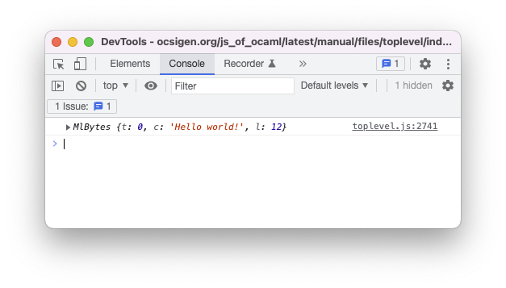
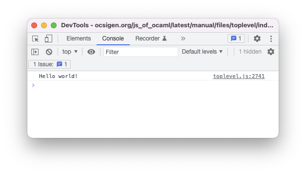

# ppx\_expjs: generate transparent JavaScript from your OCaml with Js\_of\_ocaml

## The background

There's a classic problem that arises when choosing to work with "obscure" programming languages, the core of which can be described in two parts:

1. You really like language **A**

2. The rest of the world has never heard of (or worse, dislikes) language **A**

As us OCaml programmers know, our love of the language sometimes gets in the way of doing things the most cannonical way. At Skolem, this primarily rears its head in the way we write our frontend code. While TypeScript is certainly an improvement over JavaScript, we already have a wealth of OCaml code which could be reused for the frontend.

Luckily, we're far from the first organization to have this desire. Twelve years ago, [version 1.0 of the Js\_of\_ocaml compiler was released](https://groups.google.com/g/fa.caml/c/Z7at5Nhd5wo?pli=1). Still around today, this tool lets programmers generate JavaScript directly from their OCaml to run in the browser or some other runtime (i.e. NodeJS). Js\_of\_ocaml works by acting as an OCaml bytecode-to-JavaScript translator. While this has benefits such as receiving quick updates for new compiler versions, it comes at the cost of reduced JavaScript interoperability "out of the box", as you're essentially running an OCaml bytecode VM in the browser. This limitation prompted the development of alternative OCaml-to-JS compilers, namely BuckleScript.

In 2017, I developed a passion for all things ML when I was introduced to ReasonML and BuckleScript. The promise of these projects was simple: 

- **ReasonML**: make OCaml syntax easier to grasp for newcomers used to C-style languages

- **BuckleScript**: provide an OCaml-to-JS compiler that emits readable code

Writing React code with these tools was next-level in terms of developer ergonomics. In a way, even though ReasonML was released years after React, it felt like the two were made for each other. 

BuckleScript has moved in a different direction to become ReScript, but what if you could still achieve its seamless interoperability with JavaScript using Js\_of\_ocaml?

This would open up the ability to use the plethora of tooling that exists for both JavaScript and React, as well as provide a way to gradually transition over to an OCaml-based frontend.

## The problem

Imagine that you're a brand new OCaml programmer wanting to take advantage of Js\_of\_ocaml. The first step of learning any new "language"? Writing a basic Hello World program! Naively, a new JSOO programmer might expect the following to do the trick:

```ocaml
(** Call [console.log] with the string "Hello world!" *)
let () = Js_of_ocaml.Firebug.console##log "Hello world!"
```

However, if we take a look in our console, we see that we don't quite get what we were expecting:



What we *do* see is a strange JavaScript object that does, in fact, contain our string, but a couple of other fields as well. What gives?

Well, the reason this happens is because OCaml strings and JavaScript strings are actually quite different. In JavaScript, [`String`s are arrays of UTF-16 values](https://developer.mozilla.org/en-US/docs/Web/JavaScript/Reference/Global_Objects/String#utf-16_characters_unicode_codepoints_and_grapheme_clusters), whereas in OCaml, [a `string` is an arbitrary sequence of bytes](https://v2.ocaml.org/api/String.html). For this reason, JSOO needs to carry around some metadata about the string so that they behave the same as in the native backend.

To further drive the point home, take, for example, the following code in both OCaml and JavaScript.

- OCaml:
```ocaml
let () =
  let l = String.length "😀" in
  print_int l
```
- JavaScript:
```javascript
var l = "😀".length;
console.log(l);
```

Because "😀" is `0xF0 0x9F 0x98 0x80` in UTF-8, the OCaml version prints `4`. But "😀" is `0xD83D 0xDE00` in UTF-16, so the JavaScript version prints `2`. Now we can see why JSOO needs to keep that seemingly extraneous information around -- imagine if basic functions like `String.sub` were non-deterministic!

Diving a bit deeper into the JSOO docs yields the function `Js.string`, which has type signature `string -> js_string Js.t`. Let's see if using that works:
```ocaml
let () = Js_of_ocaml.Firebug.console##log (Js.string "Hello world!")
```


Perfect! Now every time we see a string in OCaml that we want to use in JavaScript-land, we know to use `Js.string`. There's also the inverse of this function, `Js.to_string`, which takes a JavaScript representation of a string and returns an OCaml `string`.

These, combined with the useful `Js.export` function, allow us to export and convert nearly any OCaml value to JavaScript and vice-versa. However, this quickly gets to be a cumbersome practice. Writing OCaml like this has been done, but surely there's a way we can have the language generate this boilerplate for us.

## The idea

Say I have a function `f` that takes a `string` as input and returns another `string` as output. We'll be considering this trivial function:

```ocaml
let f str = str |> String.trim |> String.escaped
```

Although we know the signature for `f`, we can add some annotations to make the types available at the AST-level:

```ocaml
let f (str : string) : string = str |> String.trim |> String.escaped
```

Wait a minute, we just saw before that converting strings to and from JavaScript is a solved problem! What if we had a ppx that could consume these type annotations and perform the conversion boilerplate for us?

That's exactly the goal of ppx\_expjs 😀.

## The ppx

Let's walk through some examples of the ppx, with the first one being the function we wrote above.

The most basic usage of the ppx simply involves adding the the `[@@expjs]` attribute to any value binding:

```ocaml
let f (str : string) : string = str |> String.trim |> String.escaped
[@@expjs]
```

Running the ppx on this one-liner yields the following (admittedly scary) output:
```ocaml
let __ppx_expjs_export = Js_of_ocaml.Js.Unsafe.obj [||]
let f (str : string) = ((str |> String.trim) |> String.escaped : string)[@@expjs ]
let () =
  Js_of_ocaml.Js.Unsafe.set __ppx_expjs_export (Js_of_ocaml.Js.string "f")
    (fun str -> Js_of_ocaml.Js.string (f (Js_of_ocaml.Js.to_string str)))
let () = Js_of_ocaml.Js.export_all __ppx_expjs_export
```

However, once you get over the initial shock, the behavior is actually pretty simple. Let's break it down line-by-line.

```ocaml
let __ppx_expjs_export = Js_of_ocaml.Js.Unsafe.obj [||]
```

The first line initializes the root "export object". In the ppx, each module has its own associated "export object" which is used to collect all the exported values for that particular module.

```ocaml
let f (str : string) = ((str |> String.trim) |> String.escaped : string)[@@expjs ]
```

This is just our original function, in all its glory.

```ocaml
let () =
  Js_of_ocaml.Js.Unsafe.set __ppx_expjs_export (Js_of_ocaml.Js.string "f")
    (fun str -> Js_of_ocaml.Js.string (f (Js_of_ocaml.Js.to_string str)))
```

And this is where all the magic happens. Let's first focus on the third line of this block. We can see here that the ppx constructed an anonymous function that does a couple things:

- Takes an argument named `str`
- Passes that argument to `Js.to_string`, evidently to convert some JavaScript string to an OCaml one
- Calls our function `f` with that converted string
- Passes the return value from our function over to `Js.string`

The second line simply binds this anonymous function to the export object with the name of the OCaml value. Ok, phew, almost done.

```ocaml
let () = Js_of_ocaml.Js.export_all __ppx_expjs_export
```

Finally, we expose all of the exports we colllected to the global object (`window`, in the browser, for instance). The generated JavaScript is still an unreadable mess, but lets see if it does what we expect if we spin up a NodeJS instance:

```
Welcome to Node.js v16.13.0.
Type ".help" for more information.
> const x = require("./_build/default/example/ex.bc.js");
undefined
> x.f("\tFoo\tBar\n");
'Foo\\tBar'
```

Voila! To the user, this function may as well have been written in JavaScript, but we the developers get to utilize all the benefits of a strongly typed language like OCaml.

Let's try a more practical example: writing React components as we described earlier. Using the amazing JSOO bindings to React by @jchavarri and @davesnx, we can constuct a basic button component:

```ocaml
let%component button ~(text : string) ?(color : string = "red")
    ?(hover_color : string = "orange") () =
  let hovered, setHovered = React.use_state (fun () -> false) in
  button
    [|
      Prop.style
      @@ React.Dom.Style.make
           [|
             Style.background_color (if hovered then hover_color else color)
             Style.display "block";
             Style.border "0";
           |];
      Prop.onMouseEnter (fun _ -> setHovered (fun _ -> true));
      Prop.onMouseLeave (fun _ -> setHovered (fun _ -> false));
      Prop.onClick (fun _ ->
          Js_of_ocaml.(Dom_html.window##alert (Js.string "Hello world!")));
    |]
    [ React.string text ]
  [@@expjs]
```

This button takes a string to show as text and (optionally) colors, and shows an alert when clicked. While still fairly simple, this component utilizes some complex logic, such as callbacks and state hooks. We can then invoke the component/function in a JavaScript file like so:

```javascript
const React = require("react");
const ReactDOM = require("react-dom");
const caml = require("./ppx_expjs_react.bc.js");

const elt = <div>
  <caml.button text="ppx_expjs rules" color="lightblue" hover_color="crimson" />
</div>

ReactDOM.render(elt, document.getElementById("react-root"))
```

And after webpacking and some other magic, we get 🥁...

https://user-images.githubusercontent.com/4527949/188667724-4df3a8a6-7758-4757-81f8-655ea9ea3805.mov

...exactly the behavior we want!

You'll also notice that I was able to use JSX to call the component. This is possible because, for all functions with labelled arguments, ppx\_expjs will automatically generate an object argument for the function. This allows the caller to use object literals in the [typical JS-style](https://exploringjs.com/impatient-js/ch_callables.html#simulating-named-parameters) as well as JSX.

If we compare the OCaml we wrote to what the ppx generated, the time and effort saved on the developer's behalf is stark.

  ```ocaml
let __ppx_expjs_export = Js_of_ocaml.Js.Unsafe.obj [||]

let%component button ~(text : string) ?(color : string = "red")
    ?(hover_color : string = "orange") () = (* component implementation *)
  [@@expjs]

let () =
  Js_of_ocaml.Js.Unsafe.set __ppx_expjs_export
    (Js_of_ocaml.Js.string "button")
    (fun labelled ->
       fun () ->
         button
           ~text:(Js_of_ocaml.Js.to_string
                    (Ppx_expjs_runtime.get_required labelled "text"))
           ?color:(Option.map Js_of_ocaml.Js.to_string
                     (Ppx_expjs_runtime.get_opt labelled "color"))
           ?hover_color:(Option.map Js_of_ocaml.Js.to_string
                           (Ppx_expjs_runtime.get_opt labelled "hover_color"))
           ())

let () = Js_of_ocaml.Js.export_all __ppx_expjs_export
  ```


## The wrapup

With that, hopefully I've demonstrated a practical use case for this ppx. For those curious enough to check it out for themselves, the code can be found [here](https://github.com/skolemlabs/ppx_expjs). If you end up trying it, don't hesitate to provide feedback! Our GitHub issues are always open 😁.

Finally, I want to give a shout out to the people behind [js\_of\_ocaml](https://ocsigen.org/js_of_ocaml/latest/manual/overview), [AST Explorer](https://astexplorer.net), and [jsoo-react](https://github.com/ml-in-barcelona/jsoo-react). These projects greatly helped me in developing the ppx and elevate its usefulness as a tool.
